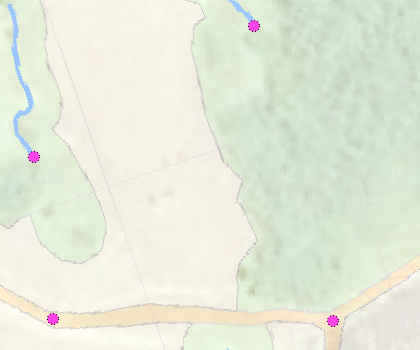
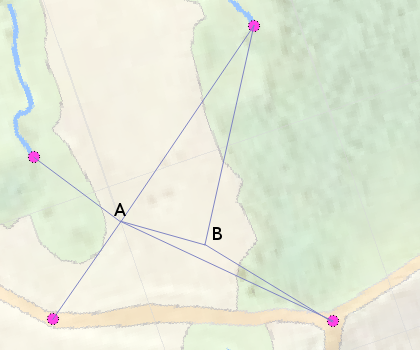
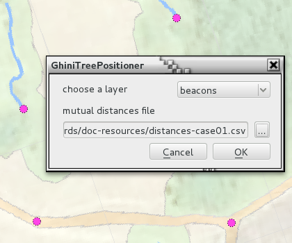
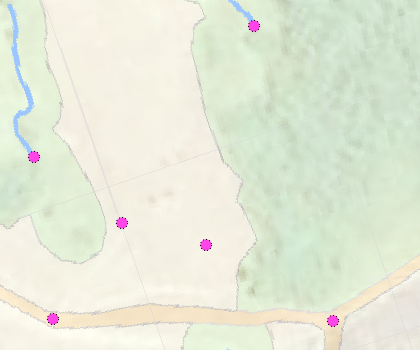

GhiniTreePositioner
======================

what is this
-------------
This plugin solves the problem of estimating accurate positions for trees under a thick canopy, or for locations where high resolution aereal photos are not available.

how does it work
------------------

Points need a 'id' property, and mutual distances must be measured in metres. Mutual distances are given in the form of a comma separated file, first two columns are the 'id' of to points, third column their distance.

The plugin implements two separate functionalities:

1. new points
~~~~~~~~~~~~~
Points already in the layer will be used as reference, Points referred to in the mutual distances file, but not in the layer, they will be added to the layer, as precisely as possible

2. GPS correction
~~~~~~~~~~~~~~~~~
You work on two layers, one with GPS data, one with the output from the plugin. The mutual distances network will be used to compute the correct pattern on the ground, the precise relative position of the points. This need not necessarily match the GPS data. This pattern is then rigidly moved to minimize the square distances to the corresponding GPS locations.

does it really work
----------------------

I consider this plugin still at a rather experimental stage, but "yes, of course it works!" I will be enhancing it as I need that, or as reaction to user feedback.

It would be highly useful if you could provide me with example data, for which, I'm quite sure, the plugin does not yet work.

show me an example
---------------------

we are in Colombia, a small area near La Macarena, I have a GeoTiff for the area and we're looking at it, and 4 reference points, they have an 'id' field and they are called, clockwise from bottom left, corner, source-2, source, and junction:

we do not own a GPS machine, or maybe the battery was down, and we observed two trees in the middle of this area, and we could measure, with the approximation of 0.5m, the distances of tree A to source-2, source, corner and junction, and of tree B to source, junction, and the other tree.

we put this information in a csv file, like this::

    A,source2,70
    A,corner,79,
    A,source,157
    A,junction,154
    B,A,58
    B,source,148.5
    B,junction,98.5

then we invoke the plugin, specifying the name of the layer, and the csv file holding the distances

and we get the result in the same layer.

